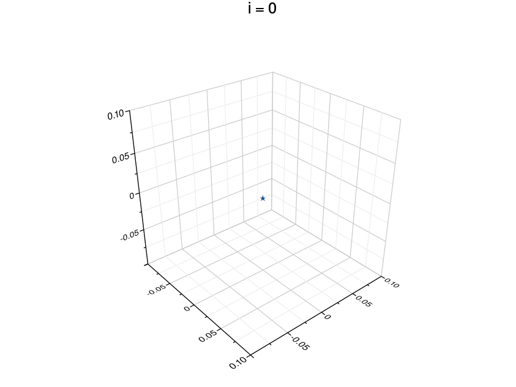

# Gifファイルを生成する

## memo

### 環境
[RubyData Docker Stacks](https://github.com/RubyData/docker-stacks)を使用
>RubyData Docker スタックは、Rubyist 向けの Jupyter とデータ ツールを含む、すぐに実行できる Docker イメージのセットです。このリポジトリは、 jupyter/docker-stacksに基づいています。

[IRuby](https://github.com/SciRuby/iruby)
>IRuby は、 Jupyter プロジェクト用の Ruby カーネルです。


```sh
(base) jovyan@54a1af4e0855:~$ which iruby
/home/jovyan/.local/share/gem/ruby/3.1.0/bin/iruby
```

### ruby-grのインストール
https://github.com/red-data-tools/GR.rb#gr-installation

dockerファイルのbuild時にinstall

#### GRのインストール

rootユーザーでログインする
```sh
docker compose exec -it -u root jupyter bash
```

xUbuntu 20.04
```sh
# https://software.opensuse.org//download.html?project=science%3Agr-framework&package=gr
echo 'deb http://download.opensuse.org/repositories/science:/gr-framework/xUbuntu_20.04/ /' | sudo tee /etc/apt/sources.list.d/science:gr-framework.list
curl -fsSL https://download.opensuse.org/repositories/science:gr-framework/xUbuntu_20.04/Release.key | gpg --dearmor | sudo tee /etc/apt/trusted.gpg.d/science_gr-framework.gpg > /dev/null
sudo apt update
sudo apt install gr
```

Set environment variable GRDIR
```sh
# dpkg -L gr
# => /usr/gr
export GRDIR="/usr/gr"

# echo $GRDIR
# => /usr/gr
```

```sh
export PKG_CONFIG_PATH="$PKG_CONFIG_PATH:/usr/gr/lib/pkgconfig"
```

### ruby-grのインストール

~/work$でbundle installを実行

### rubyファイルの実行
`bundle exec ruby hoge.rb`


## gif


